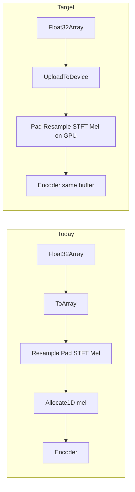

# GPU Whisper mel — PCM stays off the managed heap

**Status (2026-09-19):** Phases 1–3 done. Phase 4 (sparse mel / fuse / measure) still open.

- Phase 1: `WhisperMelPreprocessor` + oracle `WhisperMel_Gpu_MatchesCpuOracle` green on CUDA/OpenCL/CPU/WebGPU (tol 2.5e-3; CT vs direct-DFT drift documented).
- Phase 2: `SpeechRecognitionPipeline` GPU mel; `Float32Array` → `UploadToDevice` (no `ToArray` at 16 kHz).
- Phase 3: `AiSpeechEngine.TranscribeAsync(Float32Array)` calls pipeline JS overload; worker `TranscribePcmAsync` unchanged (still transfers `ArrayBuffer`).
- Optional later: Home mic ring as JS `Float32Array` (utterance slice still `float[]` today).

---

**For a fresh session.** Context: SpawnDev.AI / ML already transfer `ArrayBuffer` for Whisper over the worker, but `SpeechRecognitionPipeline.TranscribeAsync(Float32Array)` still `ToArray()`s because mel is CPU-only. Goal: 100% JS→GPU for PCM (no managed heap crossing for the waveform).

## Why today still needs `float[]`

`SpeechRecognitionPipeline.TranscribeCoreAsync` does **not** send PCM to the accelerator. It does:

1. CPU `Resample` / `PadOrTrim` / `ComputeLogMelSpectrogram` (`AudioPreprocessor.cs` — STFT centered like `torch.stft`, Slaney mel, Whisper normalize)
2. Then `Allocate1D(mel)` — only the **mel** `[1,80,3000]` hits the GPU for the encoder

So `Float32Array` → `ToArray()` exists solely for that CPU STFT. Measured earlier: mel was ~⅓ of browser Whisper wall time (fixed 30 s pad).

## What already exists

`Kernels/AudioKernels.cs` already has GPU:

- Hann window, power spectrum, mel filterbank matmul, log10 floor, `NormalizeWhisper`, stereo→mono
- **Linear** `Resample` (CPU path uses **windowed-sinc** — do not treat linear as drop-in for oracle)

File comment: *"FFT stays CPU"*. That is the missing centerpiece.

## Approach (committed)

**Ship a GPU log-mel path oracle-matched to `AudioPreprocessor.ComputeLogMelSpectrogram`**, then make `TranscribeAsync(Float32Array)` / `ArrayView` upload PCM once and keep mel on-device into the encoder.

### Phase 1 — GPU STFT + wire mel pipeline (correctness)

1. **Add GPU real STFT** for Whisper dims: `fftSize=400`, `hop=160`, `center=true`, discard final frame → **3000** frames × **201** bins (match CPU exactly).
   - N=400 is not power-of-2: implement **Bluestein** or a correct **batched real DFT** (prefer Bluestein on 512-padded chirp if feasible in ILGPU; otherwise direct rFFT DFT per frame is OK for first green gate — correctness first).
   - Output: magnitude (then reuse existing `PowerSpectrum`) or complex → power in one kernel.

2. **Compose `AudioKernels.ComputeLogMelSpectrogramGpu`** (or new `WhisperMelPreprocessor`):
   - Input: `ArrayView1D<float>` PCM at 16 kHz (length ≤ 480_000)
   - Pad/trim to `WhisperMaxSamples` on GPU (zero-fill / truncate kernel)
   - STFT → power → mel filterbank (upload **Slaney** filters once from `GenerateMelFilterbankSlaney`, cache on accelerator) → log → reduce-max → `NormalizeWhisper`
   - Output: device buffer `[80*3000]` ready as encoder input

3. **Oracle gate** (fast backends first: CUDA/OpenCL/WebGPU):
   - CPU mel vs GPU mel on fixed fixtures (silence, sine, real utterance).
   - Tolerance: match CPU float path within existing Whisper float eps (document ULP drift if any). Bit-identical preferred where IEEE allows.

### Phase 2 — Pipeline API: zero managed PCM

1. Refactor `SpeechRecognitionPipeline` (`Pipelines/AudioPipelines.cs`):
   - `TranscribeCoreAsync(ArrayView1D<float> pcm, int sampleRate)` — GPU preprocess → existing encoder capture → decoder
   - `TranscribeAsync(Float32Array)` → `Allocate1D` + `MediaInterop.UploadToDevice` (**no** `ToArray`)
   - `TranscribeAsync(float[])` → `Allocate1D` (desktop/oracle)
   - Remove host `Allocate1D(mel)` when GPU path produces mel in-place

2. **Resample**: if `sampleRate != 16000`, call GPU resample **matching CPU windowed-sinc** (upgrade/replace linear `AudioKernels.Resample`). Hands-free AI often already delivers 16 kHz — gate both rates.

3. Keep CPU `ComputeLogMelSpectrogram` as oracle; do not delete.

### Phase 3 — SpawnDev.AI consumer

1. `AiSpeechEngine.TranscribeAsync(Float32Array)`: stop `ToArray()`; call pipeline Float32Array overload (ProjectReference local ML already).
2. Worker `TranscribePcmAsync` already transfers `ArrayBuffer` — keep that; engine no longer re-materializes managed PCM for mel.
3. Optional later: Home mic ring as JS `Float32Array` so utterance slice never becomes `float[]` (not required for “transcribe is JS→GPU”).

### Phase 4 — Perf polish (after green)

- Sparse mel filter bounds on GPU (CPU already sparse — dense `ApplyMelFilterbank` walks zeros).
- Fuse power+mel+log where aliasing allows.
- Measure with existing `[AiSpeechEngine]` / `mel_ms` split — expect host mel_ms ≈ 0; preprocess cost moves into GPU timing.

## Out of scope

- WebAudio/Analyser JS STFT (not our accelerator; harder to oracle-match Whisper).
- Changing Whisper pad-to-30s product behavior (still pad; just on GPU).
- Decoder/encoder graph capture changes (encoder capture already exists).

## Verification

- Unit: CPU vs GPU mel on CUDA/OpenCL/WebGPU.
- E2E: existing Whisper / `AiSpeechTests` transcript identity (or known-tight WER) on transferable path.
- Assert `TranscribeAsync(Float32Array)` does not call `ToArray` (code review + optional debug counter).
- No commit/push unless asked.

## Fresh-session entry

- Repo: `SpawnDev.ILGPU.ML` (and SpawnDev.AI only in Phase 3).
- Start: Phase 1 STFT + oracle against `AudioPreprocessor.ComputeLogMelSpectrogram`.
- Key files: `Kernels/AudioKernels.cs`, `Preprocessing/AudioPreprocessor.cs`, `Pipelines/AudioPipelines.cs`, `Preprocessing/MediaInterop.UploadToDevice`.
- Standing rule: fast backends first (CUDA/OpenCL/WebGPU); do not gate on WebGL/Wasm timeouts.
