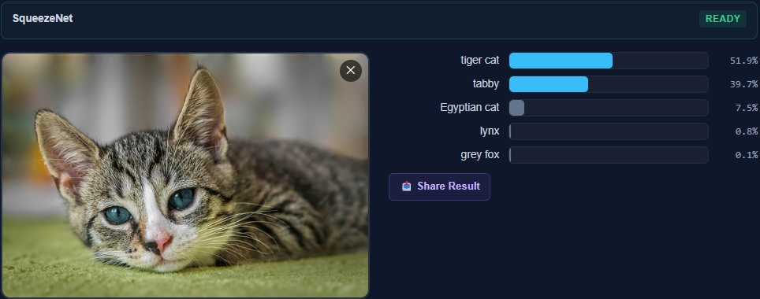
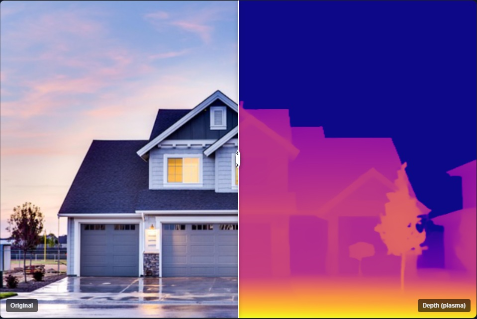
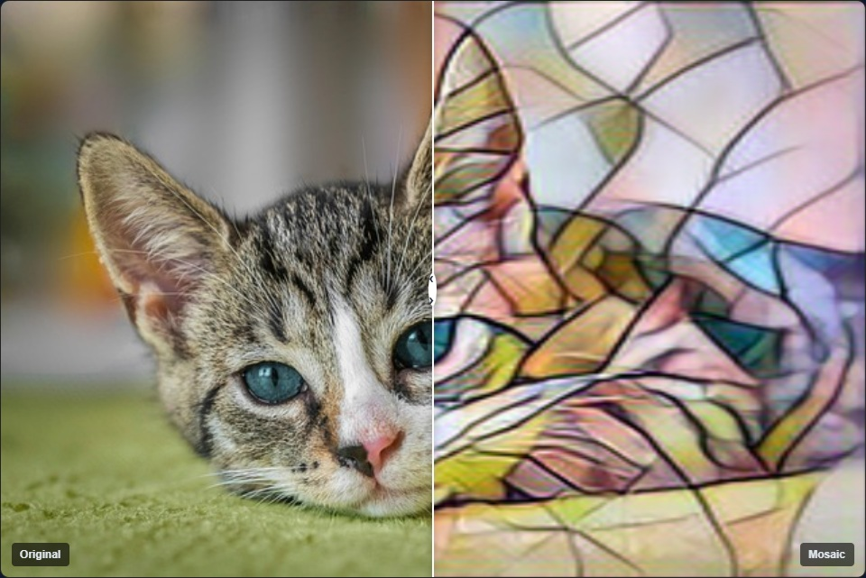
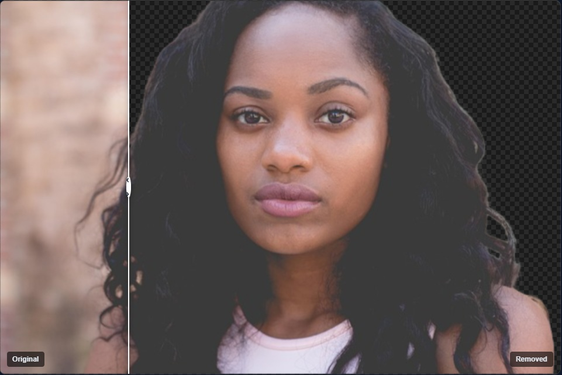
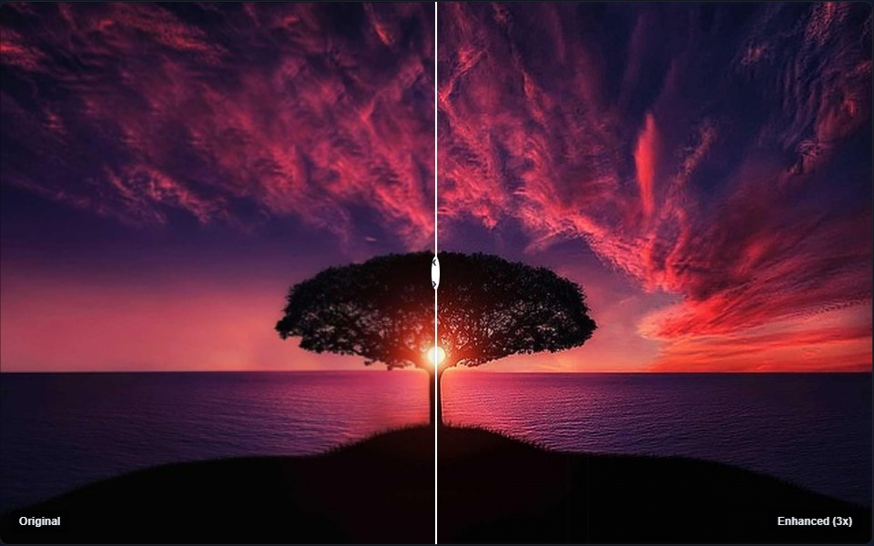
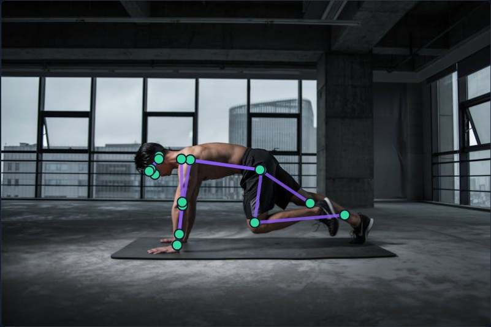

# SpawnDev.ILGPU.ML

[](https://www.nuget.org/packages/SpawnDev.ILGPU.ML)

[**Live Demo**](https://lostbeard.github.io/SpawnDev.ILGPU.ML/) — interactive GPU demos: classification, style transfer, depth estimation, object detection, pose estimation, text generation, background removal, zero-shot CLIP, and more — running on your GPU in your browser, no server. ([Which are verified vs WIP →](Docs/DEMO_AND_MODEL_STATUS.md))

**Hardware-agnostic neural network inference + training for .NET — C# compute kernels that run on WebGPU, CUDA, OpenCL, WebGL, Wasm, and CPU via [SpawnDev.ILGPU](https://github.com/LostBeard/SpawnDev.ILGPU).**

SpawnDev.ILGPU.ML implements neural network inference AND training as native GPU compute kernels written entirely in C#. Models run as compute shaders transpiled from C# — no ONNX Runtime, no JavaScript, no native binaries. The same code runs in the browser (Blazor WebAssembly) and on desktop. Drop in a model file — ONNX, TFLite, GGUF, or any of **7 inference formats** — and run it on any of six backends. Train custom models directly on your GPU in the browser — no server, no Python, no CUDA install.

> **Honest status:** not every demo or model below is finished. [**Docs/DEMO_AND_MODEL_STATUS.md**](Docs/DEMO_AND_MODEL_STATUS.md) lists exactly which demos are **VERIFIED** (passing end-to-end test, most ONNX-Runtime-matched) vs **WIP**. We mark stubs honestly — you should never click something here and get nothing.

> **Active development.** API is stabilizing but may change. Contributions and feedback welcome.

## Highlights

> **What actually works:** [**Docs/DEMO_AND_MODEL_STATUS.md**](Docs/DEMO_AND_MODEL_STATUS.md) is the source of truth — a per-demo **VERIFIED / PARTIAL / WIP** table with the test that proves each one. We mark stubs as WIP honestly, so a demo never lies to you.

- **Demos** - **13 VERIFIED end-to-end** (most matched numerically against ONNX Runtime: classification, style, depth, detection, pose, CLIP, background-removal, super-res, text-gen, embeddings, inspector, benchmark, and speech-to-text), plus several PARTIAL/WIP (image-to-3D, voice-collab, SD-Turbo image-gen are not done yet). See the status doc for exactly which.
- **16 inference pipelines** — Classification, StyleTransfer, SuperResolution, DepthEstimation, ObjectDetection, PoseEstimation, FaceDetection, TextClassification, ZeroShotClassification (CLIP), BackgroundRemoval, SpeechRecognition (Whisper), TextGeneration, FeatureExtraction, Diffusion (DDPM), TextToSpeech (SpeechT5), Image3D (TripoSR)
- **GPU training engine** — Draw custom gestures, train a CNN classifier in real-time on your GPU, test instantly. Backpropagation, gradient descent, Adam optimizer — all in C# GPU kernels. No server, no Python.
- **NLP transformers in the browser** — DistilBERT sentiment analysis, Whisper speech-to-text, text generation — all on WebGPU. No server, no upload, no cloud.
- **Local GGUF LLM inference + Ollama-compatible server** *(new in preview.5)* — run quantized LLMs (Qwen, Gemma, Llama) fully on your GPU with KV-cache decode; the Example 06 server is a drop-in Ollama replacement (OpenAI, Ollama, and Anthropic-Messages APIs) that works with the Claude CLI. ~51 tok/s decode on qwen2.5-coder:7b Q4_K_M (RTX 4070) via dp4a int8 GEMV + warp-cooperative register/flash attention (CUDA + WebGPU).
- **TurboQuant KV cache compression** — 4-5x compression of attention cache with selectable modes: **4-bit** (0.9954 cosine, ~4x), **3-bit+QJL** (0.9944 cosine, ~4x, unbiased inner products — default), or **3-bit** (0.9833 cosine, 5.3x max savings). Data-oblivious (no calibration). Automatic and transparent — every autoregressive model benefits.
- **30 GPU kernel files** — MatMul, Conv2D, FWHT, TurboQuant, RoPE, QKNorm, GroupNorm, SelectiveScan (Mamba-3), MarchingCubes, SpatialMemoryUnit, and more
- **~194 ONNX operators registered** (exact count is `OperatorRegistry.BuiltinOpTypes.Count`, rendered live on the Home page — not all are full-spec-complete; some are registered pass-throughs) — classification, style transfer, super resolution, depth estimation, pose estimation, object detection, NLP, diffusion, and more
- **7 inference model formats + 4 mesh/splat IO formats** — *inference loaders:* ONNX, TFLite, GGUF, SafeTensors, TF GraphDef, PyTorch, CoreML. *Mesh/splat import-export (not inference):* SPZ, PLY, glTF, OBJ. Zero-dependency, auto-detected from magic bytes. First pure C# SPZ parser. (Loading a format ≠ running every model in it end-to-end — see the status doc.)
- **6 backends from one codebase** — WebGPU, WebGL, Wasm, CUDA, OpenCL, CPU
- **HuggingFace CDN** — All models load from HuggingFace with OPFS caching. No bundling. Search, browse, and load any public model.
- **Zero-copy GPU pipeline** — Data enters the GPU at preprocessing and stays until the pixel hits the canvas. CanvasRendererFactory for GPU→canvas rendering without CPU readback.
- **Streaming weight loader** — Large models (GPT-2 652MB) load one tensor at a time. Minimal CPU peak memory. FP16 on GPU supported.
- **122+ numpy-verified operator tests** — every operator validated against known-correct reference data, CPU reference comparison minimum bar
- **Single image to 3D** — TripoSR for exportable meshes (glTF/OBJ), LGM for Gaussian splats (SPZ/PLY)
- **Model Inspector** — drop any model file (ONNX, TFLite, GGUF, SafeTensors, and more) for instant architecture analysis and compatibility check. No other browser ML library has this.
- **P2P Model Delivery + Shared Compute** — [SpawnDev.WebTorrent](https://github.com/LostBeard/SpawnDev.WebTorrent) integration for decentralized model delivery via BitTorrent. BEP 46 DHT mutable items enable AI agents to share state (KV cache, model weights, coordination) across devices via the DHT — no central server. Ed25519 signing (RFC 8032). Foundation for `AcceleratorType.P2P` distributed compute.

## What's verified in `4.0.0-preview.5`

Six demos are end-to-end working today on WebGPU + WebGL + Wasm + CPU + CUDA + OpenCL — fully native C# kernels, no ONNX Runtime, no JS bridge, no native binaries:

| Demo | Model | Pipeline |
|------|-------|----------|
|  | **Image classification** — SqueezeNet 1.1 | `ClassificationPipeline` |
|  | **Monocular depth estimation** — Depth Anything V2 Small (95MB) | `DepthEstimationPipeline` |
|  | **Neural style transfer** — Mosaic ONNX Model Zoo | `StyleTransferPipeline` |
|  | **Background removal** — RMBG-1.4 | `BackgroundRemovalPipeline` |
|  | **3x super-resolution** — ESPCN, tile-based with color and source-aspect preservation | `SuperResolutionPipeline` |
|  | **Pose estimation** — MoveNet Lightning (17 keypoints), skeleton overlaid on a GPU-rendered frame | `PoseEstimationPipeline` |

Every result above is rendered directly from a GPU buffer to an HTML `<canvas>` via the library's `ICanvasRenderer` — no PNG encode, no base64 data URL, no host readback of pixel data. The depth and super-res pipelines preserve source aspect ratio (e.g., a 16:9 photo produces a 16:9 result, not a square). Super-res uses tile-based inference so the full source resolution gets the model's enhancement, not just a thumbnail.

The pose keypoints match ONNX Runtime 1.24.3 across all six backends, and the `/pose` demo supports both live webcam and file-upload modes.

**Text generation** is verified end-to-end on WebGPU as the 7th demo pipeline: the `/text-gen` demo streams DistilGPT-2 from the SpawnDev hub (`hub.spawndev.com`) over a **seekable torrent stream straight to the GPU** — the model is never held whole in memory — then runs autoregressive generation entirely on-device. The **Model Inspector** (`/inspector`) is fully working: drop a local file or paste a hub/HuggingFace URL and any ONNX/TFLite/GGUF/SafeTensors model is parsed structure-only (weights skipped) into an architecture summary + operator-compatibility report — GPT-2 reports **100% supported**. No other browser ML library has either.

9 more pipelines exist in the codebase (object detection, face detection, other NLP, diffusion, TTS, single-image-to-3D) but aren't all verified end-to-end yet on every backend — that's the work ahead.

## Universal Model Loading

One API loads models from any ML ecosystem. Format is auto-detected from magic bytes — no configuration needed.

| Format | Ecosystem | What It Opens |
|--------|-----------|--------------|
| **ONNX** (.onnx) | PyTorch, ONNX Model Zoo | Industry standard. Most exported models. |
| **TFLite** (.tflite) | TensorFlow, MediaPipe, Google | Mobile/edge models. Face detection, pose, classification. |
| **GGUF** (.gguf) | llama.cpp, HuggingFace | Quantized LLMs. Llama, Mistral, Phi, SmolLM. |
| **SafeTensors** (.safetensors) | HuggingFace | Safe weight format. Nearly every HF model. |
| **TF GraphDef** (.pb) | TensorFlow 1.x/2.x | Frozen graphs, TF Hub models. |
| **PyTorch** (.pt/.pth) | PyTorch research | Weight extraction from checkpoints. |
| **Core ML** (.mlmodel) | Apple, iOS/macOS | Apple's Neural Engine models. |

```csharp
// All of these work — format detected automatically from magic bytes
var session = InferenceSession.CreateFromFile(accelerator, modelBytes);

// Or load from HTTP with auto-detection
var session = await InferenceSession.CreateFromFileAsync(accelerator, http, "model.onnx");
var session = await InferenceSession.CreateFromFileAsync(accelerator, http, "model.tflite");
var session = await InferenceSession.CreateFromFileAsync(accelerator, http, "model.gguf");

// Format-specific when you know the type
var session = InferenceSession.CreateFromOnnx(accelerator, onnxBytes);
var session = InferenceSession.CreateFromTFLite(accelerator, tfliteBytes);
var session = InferenceSession.CreateFromGGUF(accelerator, ggufBytes);
var session = InferenceSession.CreateFromSafeTensors(accelerator, safetensorBytes);
var session = InferenceSession.CreateFromPyTorch(accelerator, ptBytes);
var session = InferenceSession.CreateFromCoreML(accelerator, mlmodelBytes);
var session = InferenceSession.CreateFromTFGraphDef(accelerator, pbBytes);
```

## Transformers.js-style API — `Tensor<T>`, `OwnedTensor<T>`, `RunOwnedAsync`

If you've used [Transformers.js](https://huggingface.co/docs/transformers.js) or ONNX Runtime, the input/output ergonomics will feel familiar. Models accept named `Tensor<T>` inputs and return an `OwnedTensorMap<T>` — a disposable bag of named outputs. Caller owns every output buffer, and `using` cleans them up in one go.

```csharp
using var session = await InferenceSession.CreateFromFileAsync(
    accelerator, http, "models/squeezenet/model.onnx");

// Allocate the model input as an OwnedTensor — wraps a fresh GPU buffer.
// FromHost copies the host pixels to the accelerator in one shot.
using var input = OwnedTensor<float>.FromHost(
    accelerator, pixels, new[] { 1, 3, 224, 224 });

// Transformers.js-style call. Inputs are Tensor<float> (OwnedTensor converts
// implicitly). Outputs come back as OwnedTensorMap<float> — each output tensor
// is in its own freshly-allocated GPU buffer, independent of the session's
// internal pool. Run B will not mutate Run A's outputs.
using var outputs = await session.RunOwnedAsync(new Dictionary<string, Tensor<float>>
{
    [session.InputNames[0]] = input,
});

var logits = outputs[session.OutputNames[0]]; // OwnedTensor<float>
var hostLogits = await logits.ToHostAsync();   // copy back to CPU when needed
```

Under the hood there are three types, mirroring the split ILGPU itself uses between `MemoryBuffer<T>` (class, lifetime-managing) and `ArrayView<T>` (struct, kernel-passable):

- **`Tensor<T>`** — host-side reference type, shape-tracked view over an `ArrayView1D<T, Stride1D.Dense>`. Reshape / Slice / SubTensor are zero-copy. Generic over `T : unmanaged` (float, int, Half, etc.).
- **`OwnedTensor<T>`** — `IDisposable` wrapper that owns a `MemoryBuffer1D<T>`. What pipelines return. Implicit conversions to `Tensor<T>` and `TensorView<T>` mean you never have to write `.AsTensor` or `.View` at a call site.
- **`TensorView<T>`** — blittable struct, passable directly to ILGPU kernels. Inline `D0..D3` + `Rank`. Replaces the old "pass an ArrayView + four shape ints" idiom. Kernel authors write `Get4D(n, c, h, w)` instead of doing manual row-major stride math.

```csharp
// Kernel takes the tensor directly — no scalar W/H parameters.
private static void DoubleKernel(Index1D idx,
    TensorView<float> input, TensorView<float> output)
{
    int w = idx % input.D3;
    int h = (idx / input.D3) % input.D2;
    int c = (idx / (input.D3 * input.D2)) % input.D1;
    int n = idx / (input.D3 * input.D2 * input.D1);
    output.Set4D(n, c, h, w, input.Get4D(n, c, h, w) * 2f);
}
```

### Format Details

| Format | Graph Construction | Weight Types | Tested Models |
|--------|-------------------|-------------|---------------|
| **ONNX** | Full parser, 200+ ops, external data | F32, F16 | SqueezeNet, MobileNet, DistilBERT, GPT-2, Whisper, DA3, YOLOv8, MoveNet, CLIP, RMBG, SD-Turbo |
| **TFLite** | FlatBuffer parser, NHWC layout, 60+ op mappings, fused activations | F32, F16, INT8, UINT8 (auto-dequant) | BlazeFace, EfficientNet-Lite, MediaPipe models |
| **GGUF** | Architecture-aware graph builder (Llama family) | F32, F16, Q8_0, Q4_0, Q4_1, Q5_0, Q5_1 | SmolLM, TinyLlama, Phi-4 Mini |
| **SafeTensors** | Config-driven graph builder (encoder/vision/decoder architectures) | F32, F16, BF16, F64, I32, I16, I8, U8 | HuggingFace transformer weights |
| **TF GraphDef** | Protobuf parser + op mapping to ONNX equivalents | F32, F16, INT32, DOUBLE | TensorFlow frozen graphs |
| **PyTorch** | ZIP + PickleReader + weight extraction | F32, F16, BF16 | PyTorch checkpoints (weight inspection) |
| **Core ML** | Protobuf parser + neural network layer mapping | F32, F16 | Apple .mlmodel files |

Every format produces the same `ModelGraph` intermediate representation. All 200+ operators, all 30 GPU kernels, all 6 backends, and the full graph optimizer work identically regardless of source format. **Write one pipeline, load from any ecosystem.**

## How It Works

Neural network operations (matrix multiply, convolution, normalization, attention) are implemented as [ILGPU](https://github.com/m4rs-mt/ILGPU) kernels in C#. [SpawnDev.ILGPU](https://github.com/LostBeard/SpawnDev.ILGPU) transpiles each kernel to the target shader language at runtime:

```
C# Kernel Code
    |
    v
SpawnDev.ILGPU (transpilation)
    |
    +---> WGSL      (WebGPU)      -- browser GPU
    +---> GLSL      (WebGL)       -- browser GPU (universal)
    +---> Wasm      (Web Workers) -- browser CPU
    +---> PTX       (CUDA)        -- NVIDIA GPU
    +---> OpenCL C  (OpenCL)      -- any GPU
    +---> CPU       (threads)     -- no GPU needed
```

## Quick Start

### Load and Run Any Model

```csharp
using SpawnDev.ILGPU;
using SpawnDev.ILGPU.ML;
using SpawnDev.ILGPU.ML.Pipelines;

// Create accelerator (auto-selects best backend)
var builder = MLContext.Create();
await builder.AllAcceleratorsAsync();
var context = builder.ToContext();
var accelerator = await context.CreatePreferredAcceleratorAsync();

// Load any model from any URL — format auto-detected from magic bytes
var session = await InferenceSession.CreateFromFileAsync(
    accelerator, httpClient, "models/squeezenet/model.onnx");
// Works with any URL and any supported format:
//   "models/blaze-face/model.tflite"                                    — local TFLite
//   "https://huggingface.co/org/repo/resolve/main/model.onnx"          — HuggingFace
//   "https://storage.googleapis.com/mediapipe-models/.../model.tflite"  — Google CDN

// Classify an image
var pipeline = new ClassificationPipeline(session, accelerator);
var results = await pipeline.ClassifyAsync(rgbaPixels, width, height);

Console.WriteLine($"{results[0].Label}: {results[0].Confidence:P1}");
// Output: "tiger cat: 52.0%"
```

### Using a Kernel Directly

```csharp
var matMul = new MatMulKernel(accelerator);

using var a = accelerator.Allocate1D<float>(M * K);
using var b = accelerator.Allocate1D<float>(K * N);
using var c = accelerator.Allocate1D<float>(M * N);

matMul.MatMul(a.View, b.View, c.View, M, K, N);
await accelerator.SynchronizeAsync();
var result = await c.CopyToHostAsync<float>();
```

## Examples

A progressive ladder of self-contained example projects under [`Examples/`](Examples/README.md) — from a minimal
model inspect to a full inference server. Highlight:

- **`06.OllamaServer.Console` — a drop-in Ollama replacement 🚧 (WIP).** Turns this engine into a native-GPU GGUF
  inference server that prebuilt agentic frontends (**Claude CLI**, Pi, Codex, OpenCode, Continue, …) talk to with
  zero reconfiguration. Speaks **OpenAI**, **Ollama-native**, and **Anthropic Messages** APIs at once, and serves
  the GGUF models **already in your `~/.ollama` cache, zero-copy**. Functional end-to-end today (qwen2.5-coder,
  gemma4 — KV-cache decode, streaming, tool-calling); the active work is matching Ollama's speed (vectorized-load +
  fused GEMV) and large-context decode for 12B models. See [`Examples/06.OllamaServer.Console`](Examples/06.OllamaServer.Console/README.md).

## Supported Backends

| | WebGPU | WebGL | Wasm | CUDA | OpenCL | CPU |
|---|---|---|---|---|---|---|
| **Runs on** | GPU | GPU | Workers | NVIDIA GPU | Any GPU | CPU cores |
| **Transpiles to** | WGSL | GLSL ES 3.0 | Wasm binary | PTX | OpenCL C | Threads |
| **Shared memory** | Yes | No | Yes | Yes | Yes | Yes |
| **Environment** | Browser | Browser | Browser | Desktop | Desktop | Desktop |

Auto-selection: WebGPU > WebGL > Wasm (browser) or CUDA > OpenCL > CPU (desktop).

## Validated Models

### Vision Models

| Model | Task | Size | Status |
|-------|------|------|--------|
| **SqueezeNet** | Classification (1000 classes) | 5 MB | **Working** — matches ONNX Runtime reference |
| **MobileNetV2** | Classification (1000 classes) | 13 MB | Compiles, graph runs |
| **ESPCN** | Super Resolution (3x) | 100 KB | **Working** — matches ONNX Runtime reference |
| **Style Transfer** (5 models) | Artistic style transfer | 6-7 MB each | **Working** — 112 nodes, reference-matched |
| **YOLOv8 Nano** | Object detection (80 classes) | 12.2 MB | **Working** — matches ONNX Runtime reference |
| **Depth Anything V2 Small** | Monocular depth estimation | 95 MB | Compiles (823 nodes, 25 op types) |
| **MoveNet Lightning** | Pose estimation (17 keypoints) | 9 MB | **Working** — matches ONNX Runtime reference |
| **BlazeFace** | Face detection | 229 KB | TFLite — loads and runs |
| **EfficientNet-Lite0** | Classification (1000 classes) | 17.7 MB | TFLite — loads and runs |

Style models: mosaic, candy, rain princess, udnie, pointilism.

### NLP Models

| Model | Task | Size | Status |
|-------|------|------|--------|
| **Phi-4 Mini 3.8B** | Conversational LLM | ~2.3 GB (Q4 GGUF) | Tier 1: works on any 4GB+ GPU. MIT license. |
| **Mistral NeMo 12B** | Conversational LLM | ~7 GB (Q4 GGUF) | Tier 2: premium quality on 8GB+ GPU. Apache 2.0. |
| **Phi-4 14B** | Conversational LLM | ~8 GB (Q4 GGUF) | Tier 3: maximum intelligence on 12GB+ GPU. MIT license. |
| **DistilBERT-SST2** | Sentiment analysis | 268 MB | **Working** — matches ONNX Runtime reference |
| **DistilGPT-2** | Text generation | 314 MB | **Working** — streaming weight loader |
| **Whisper Tiny** | Speech-to-text | 231 MB | **Working** - microphone to text, verified on all six backends (`Pipeline_Whisper_TranscribesKnownSpeech`) |
| **SD-Turbo** | Image generation | ~2.5 GB (FP16) | ONE step, 512x512 from text prompts |
| **CLIP ViT-B/32** | Vision-language embeddings | 606 MB | Zero-shot classification from any text |
| **SpeechT5** | Text-to-speech | 643 MB | Neural voice synthesis |
| **DDPM MNIST** | Image generation (lightweight) | 1 MB | Diffusion pipeline proof-of-concept |

## Architecture

### Multi-Format Inference Engine

```
Any model file (.onnx, .tflite, .gguf, .safetensors, .pb, .pt, .mlmodel)
    |
    v
Format auto-detection (magic bytes) → appropriate parser
    |
    v
ModelGraph (shared IR — nodes, weights, shapes)
    |
    v
GraphOptimizer (6 passes: constant fold, identity elim, linear fusion,
                scaled matmul fusion, strength reduction, dead node elim)
    |
    v
GraphCompiler (200+ operators + fused ops → execution plan)
    |
    v
GraphExecutor (topological dispatch, buffer recycling, periodic flush)
    |
    v
InferenceSession (public API: CreateFromFileAsync / Run / RunAsync)
```

**Model loading** — one API, any format:
```csharp
// Auto-detect format from magic bytes
var session = await InferenceSession.CreateFromFileAsync(accelerator, http, "model.onnx");
var session = await InferenceSession.CreateFromFileAsync(accelerator, http, "model.tflite");
var session = await InferenceSession.CreateFromFileAsync(accelerator, http, "model.gguf");
```

Or use format-specific methods: `CreateFromOnnxAsync`, `CreateFromTFLiteAsync`, `CreateFromGGUFAsync`, `CreateAsync` (pre-extracted), `Create` (programmatic).

All formats produce the same `ModelGraph` IR — every operator, kernel, optimizer pass, and backend works identically regardless of source format.

### Graph Optimizer (automatic, 6 passes)

Every model is automatically optimized during compilation:

| Pass | What It Does | Impact |
|------|-------------|--------|
| **Constant folding** | Evaluates Shape→Gather→Cast→Floor chains at compile time | Eliminates shape-computation subgraphs |
| **Identity elimination** | Removes Identity/Dropout no-ops | Cleaner graph, fewer dispatches |
| **Linear fusion** | MatMul + Add + Activation → single FusedLinear dispatch | 2/3 less memory bandwidth |
| **Scaled MatMul fusion** | MatMul + Scale → FusedScaledMatMul | Attention optimization |
| **Strength reduction** | Div→Mul, eliminate Mul×1 and Add+0 | Cheaper operations |
| **Dead node elimination** | Removes orphaned nodes after fusion | Clean graph |

### GPU Kernels (30 files)

| Kernel | Description | Performance |
|--------|-------------|-------------|
| **MatMul** | Tiled 16x16 shared memory | 92-101 GFLOPS |
| **RegisterBlockedMatMul** | 4x4 register blocking, 64x64 tiles | Target: 200+ GFLOPS |
| **FusedLinear** | MatMul + Bias + Activation in 1 dispatch | 3x less memory bandwidth |
| **Conv2D / ConvTranspose2D** | Arbitrary kernel/stride/padding | — |
| **InstanceNorm** | Two-pass O(N) per (N,C) slice | 50,000x faster than naive |
| **LayerNorm / BatchNorm / RMSNorm** | All normalization variants | — |
| **Softmax** | Two-pass numerically stable | — |
| **Attention** | Multi-head split/score/merge | — |
| **GELU/ReLU/SiLU** | With in-place variants | — |
| **ImagePreprocess** | RGBA → NCHW, resize + normalize, Y-channel | GPU preprocessing |
| **ImagePostprocess** | NCHW float → packed RGBA on GPU | Zero-copy output |
| **DepthColormap** | Depth float → colored RGBA via GPU LUT | GPU visualization |
| **PostProcessing** | YOLO decode, NMS filter, cosine similarity, L2 norm | GPU postprocessing |
| **ColorConversion** | RGB↔YCbCr, grayscale, BGR on GPU | — |
| **ImageTransform** | GPU resize, crop, flip | — |
| **TensorLayout** | NCHW↔NHWC, interleaved↔planar on GPU | — |
| **FWHT** | Fast Walsh-Hadamard Transform (TurboQuant core) | O(d log d) |
| **TurboQuant** | KV cache compression via FWHT: 4-bit (0.9954 cosine), 3-bit (5.3x, 0.9833), 3-bit+QJL (0.9944, unbiased — default). Fused attention. | 4-5x compression |
| **RoPE** | Rotary Position Embeddings (DA3, LLaMA, Mistral) | — |
| **QKNorm** | L2-normalize Q/K per head (DA3) | — |
| **GroupNorm** | Per-group normalization for U-Net (LGM) | — |
| **SelectiveScan** | Mamba-3 SSM + MIMO + O(1) decode | Linear scaling |
| **SpatialMemory** | AsyncMDE convex combination + EMA cache | Real-time depth |
| **MarchingCubes** | 3D isosurface extraction (TripoSR) | — |
| **Training** | SoftmaxCE, ReLU/Conv2D/MaxPool backward, SGD, Adam | GPU training |

### ~194 ONNX Operators Registered

**Core Math:** Abs, Add, Sub, Mul, Div, Pow, Sqrt, Exp, Log, Neg, Reciprocal, Floor, Ceil, Mod, Clip, Min, Max, Sign, Erf, CumSum
**Trig:** Sin, Cos, Tan, Acos, Acosh, Asin, Asinh, Atan, Atanh, Cosh, Sinh
**Activations:** Relu, Sigmoid, Tanh, Gelu, LeakyRelu, HardSigmoid, HardSwish, Elu, Celu, Selu, Softplus, Softsign, Mish, ThresholdedRelu, PRelu, SiLU
**Comparison:** Equal, Greater, GreaterOrEqual, Less, LessOrEqual, And, Or, Xor, Not, IsNaN, IsInf
**Reduction:** ReduceSum, ReduceMean, ReduceMax, ReduceMin, ReduceProd, ReduceL1, ReduceL2, ReduceSumSquare, ReduceLogSum, ReduceLogSumExp
**Shape:** Reshape, Squeeze, Unsqueeze, Flatten, Expand, Shape, Slice, Concat, Split, Transpose, Tile, Pad, Compress, EyeLike, Trilu, Unique, ReverseSequence, CenterCropPad
**Pooling:** MaxPool, AveragePool, GlobalAveragePool, GlobalMaxPool, LpPool, GlobalLpPool, MaxUnpool, MaxRoiPool
**Normalization:** BatchNormalization, InstanceNormalization, LayerNormalization, GroupNormalization, LRN, MeanVarianceNormalization, LpNormalization
**Convolution:** Conv, ConvTranspose, ConvInteger, DeformConv
**Linear:** MatMul, Gemm (transA+transB), MatMulInteger, QLinearMatMul, QLinearConv
**Gather/Scatter:** Gather, GatherElements, GatherND, ScatterND (add/mul/min/max reduction), ScatterElements, Scatter
**Data:** Constant, ConstantOfShape, Cast, CastLike, Identity, Size, OneHot, Range, NonZero, TopK, ArgMax, ArgMin, Round
**Quantization:** DequantizeLinear, QuantizeLinear, DynamicQuantizeLinear
**Bitwise:** BitwiseAnd, BitwiseOr, BitwiseXor, BitwiseNot, BitShift
**Signal:** DFT, STFT, MelWeightMatrix, HannWindow, HammingWindow, BlackmanWindow
**Recurrent:** RNN, LSTM, GRU (bidirectional, peepholes, layout support)
**Control Flow:** If, Loop, Scan (real subgraph execution via SubgraphRunner)
**Detection:** NonMaxSuppression, RoiAlign, AffineGrid, GridSample, Col2Im
**Random:** RandomNormal, RandomNormalLike, RandomUniform, RandomUniformLike, Bernoulli, Multinomial
**Misc:** Dropout, Where, Resize, Upsample, DepthToSpace, SpaceToDepth, Einsum, Softmax, LogSoftmax, Hardmax, Sum, Mean, Det, ImageDecoder
**Sequence/Optional/String:** Full pass-through support for non-tensor ONNX types

### Pipeline Classes (18 implemented; not all verified end-to-end — see status doc)

| Pipeline | Input | Output |
|----------|-------|--------|
| **ClassificationPipeline** | RGBA image | Top-K labels + confidence |
| **SuperResolutionPipeline** | RGBA image | Upscaled RGBA image (GPU-direct) |
| **StyleTransferPipeline** | RGBA image | Stylized RGBA image (GPU-direct via CanvasRendererFactory) |
| **DepthEstimationPipeline** | RGBA image | Depth map with GPU plasma colormap |
| **ObjectDetectionPipeline** | RGBA image | Bounding boxes + labels (YOLOv8 + NMS) |
| **PoseEstimationPipeline** | RGBA image | 17 keypoints with confidence (MoveNet) |
| **FaceDetectionPipeline** | RGBA image | Face boxes + 6 landmarks (BlazeFace TFLite) |
| **BackgroundRemovalPipeline** | RGBA image | Foreground with transparent background (RMBG) |
| **ZeroShotClassificationPipeline** | RGBA image + text labels | Ranked labels by similarity (CLIP dual-encoder) |
| **TextClassificationPipeline** | Token IDs | Sentiment predictions (DistilBERT) |
| **FeatureExtractionPipeline** | Token IDs | L2-normalized embedding vector |
| **TextGenerationPipeline** | Prompt text | Generated text (autoregressive, DistilGPT-2) |
| **SpeechRecognitionPipeline** | Audio samples | Transcribed text (Whisper encoder+decoder) |
| **AsyncDepthPipeline** | RGBA frames | Real-time depth with fast/slow path blending |

## Demo App

The demo is a Blazor WebAssembly app showcasing what's possible when GPU inference runs entirely in the browser — no server, no uploads, no cloud. Everything stays on the user's device.

### Working Now

| Demo | What It Does | Status |
|------|-------------|--------|
| **Image Classification** | Drop a photo, get top-5 ImageNet predictions with confidence bars. Race Mode compares inference speed across WebGPU/WebGL/Wasm side-by-side. | **Live** |
| **Neural Style Transfer** | Turn your photo into a Van Gogh, Monet, or Picasso. 5 style models, instant gallery switching. Before/after slider. | **Live** |
| **Super Resolution** | Upload a small image, get 3x upscale. Before/after comparison with download. | **Live** |
| **Model Inspector** | Drop any model file (ONNX, TFLite, GGUF, SafeTensors...) for instant architecture analysis — node count, parameters, operators, compatibility check. | **Live** |

### Vision Demos

| Demo | What It Does |
|------|-------------|
| **Depth Estimation** | Generate depth maps from any photo. GPU plasma colormap via CanvasRendererFactory zero-copy rendering. Depth Anything V2 runs on WebGPU. |
| **Real-Time Object Detection** | Live webcam with bounding boxes. 80 COCO classes, confidence slider, FPS counter. GPU-accelerated NMS. |
| **Background Removal** | One-click background removal. Transparent PNG download. Replace background with custom image or blur. |
| **Pose Estimation** | Live webcam with skeleton overlay. 17 keypoints, joint angles, movement trails. MoveNet Lightning already compiles. |
| **Face Detection** | Face detection with landmarks and confidence visualization. |
| **Zero-Shot (CLIP)** | Type ANY text description. Classify images by it. No fixed categories — the user defines what to look for. |

### Language & Audio Demos

| Demo | What It Does |
|------|-------------|
| **Speech to Text** | Whisper-powered transcription. Upload audio or use the microphone — transcription runs on your GPU, never leaves your device. |
| **Semantic Search** | Generate text embeddings. Find similar passages, rank by relevance — all computed locally. |
| **Text Generation** | GPT-style text generation with greedy/top-K/top-P sampling, temperature control, and tokens/second counter. |

### Experimental & Fun Demos

| Demo | What It Does | Why It's Special |
|------|-------------|-----------------|
| **AI Assistant** | Remember Clippy, Merlin, and Robby? They're back — but now they actually think. Choose from 6 classic MS Agent-style characters, talk to them via voice or text, and they respond with AI-generated text and speech. Tiered LLM selection: Phi-4 Mini 3.8B (4GB+ GPU), Mistral NeMo 12B (8GB+), or Phi-4 14B (12GB+) — auto-detected or user-selectable. Voice input via Whisper, voice output via SpeechT5 — all running on your GPU. | A real LLM running in your browser — up to 14B parameters on high-end GPUs. No API key. No server. No internet after model loads. The demo auto-selects the best model for your hardware, or you choose. The thing Microsoft dreamed of in 1997 — now running on WebGPU. |
| **Comic Chat AI** | A comic strip chat room where every character is an AI running locally. Add characters, give them personalities ("sarcastic pirate", "enthusiastic scientist"), and watch them debate in comic panel format. Tiered LLM: Phi-4 Mini (4GB+), Mistral NeMo (8GB+), or Phi-4 14B (12GB+) with per-character system prompts — same model, different personalities. Auto-detected or selectable. Inspired by Microsoft Comic Chat (1996), reimagined with local AI. | Multiple AI characters with genuine personality differences, powered by up to a 14B LLM on your GPU, debating and joking in comic panels. Pure nostalgia meets bleeding-edge tech. |
| **Inside the Network** | Peek inside the neural network. See feature maps, attention patterns, and activation heatmaps as the model processes your image — layer by layer. Scrub through layers to see what the GPU "sees." | Educational and mesmerizing. Shows that neural networks aren't magic — they're math running on your GPU, and you can watch it happen. |
| **Draw to Train** | Draw custom gestures on an interactive canvas, train a CNN classifier in real-time on your GPU, then watch it classify as you draw. Live loss/accuracy curves during training. The model learns in seconds — and you can test it immediately by drawing new shapes. Export trained models as ONNX. | Most browser ML can only do inference. This is full GPU training: forward pass, backpropagation, gradient descent — all in C# compute shaders on WebGPU. No server, no Python, no CUDA install. Draw → Train → Use, all in one browser tab. |
| **Pipeline Composer** | Visual drag-and-drop model builder. Compose neural network architectures by wiring blocks: Conv2D → ReLU → MaxPool → Linear. Auto-propagation of tensor shapes through the graph. Dimension mismatch highlighting (orange = warning, red = error). Three-stage workflow: Data → Architecture → Train & Run. Save/load pipeline configurations as JSON. | Build a complete ML pipeline visually — define your data source, compose your model architecture, configure training, watch it learn, run inference. No code required. Inspired by visual ML tools, but running entirely on your GPU in the browser. |
| **Voice Collaboration** | Talk to your AI dev team. Whisper STT on your GPU, tiered LLM reasoning (3.8B–14B, auto-selected or user choice), SpeechT5 TTS responds with voice — all neural, all GPU, all private. Multiple agents with distinct personas and voices. | The full voice AI pipeline on YOUR hardware: speech → LLM (up to 14B) → voice. No cloud. No API key. No data leaves your device. The best model your GPU can run, automatically or by choice. |

### Generative & 3D Demos

| Demo | What It Does |
|------|-------------|
| **Image Generation** | SD-Turbo: type a text prompt, get a 512x512 image in ONE inference step (~1 second). Real Stable Diffusion running on your GPU in the browser — no server, no API key. 2.5GB model streamed to GPU via HuggingFace CDN. Also includes DDPM MNIST (1MB) as lightweight fallback. |
| **Image to 3D (TripoSR)** | *Planned for v4.1.0* — DINOv1 encoder + Triplane transformer + Marching Cubes. 3D format support (glTF/OBJ/SPZ/PLY) already implemented. Awaiting ONNX model conversion. |
| **Image to Gaussian Splats (LGM)** | Drop a photo, generate 65,536 photorealistic Gaussian splats. Fly through the 3D scene in [SpawnScene](https://github.com/LostBeard/SpawnScene). Export as SPZ (15-20x compressed) or PLY. |
| **Depth Voxel** | Live webcam depth → 3D point cloud visualization. ML inference feeding directly into 3D rendering, all on GPU, no CPU readback. |

### Infrastructure Demos

| Demo | What It Does |
|------|-------------|
| **Backend Showdown** | Run the same model on all available backends simultaneously. Leaderboard of inference times. Copy-paste shareable results. |
| **Model Inspector** | Drop any model file for instant architecture analysis and compatibility check. All 7 formats supported. |
| **Model Gallery** | Browse all available demo models. Load custom models from HuggingFace. |
| **Getting Started** | 5-step interactive tutorial with code examples. |

All demos include backend selection, inference timing, "100% client-side" privacy badges, keyboard shortcuts (`?` for help, `Space` = run, `D` = download), and the voice command system ("Computer, classify this image").

Most demo pages run real models on your GPU in your browser — but not all are finished. [**Docs/DEMO_AND_MODEL_STATUS.md**](Docs/DEMO_AND_MODEL_STATUS.md) says exactly which.

### The Wow Factor

**Real today:**
- **Backend Race Mode** — Run the same model on WebGPU, WebGL, and Wasm simultaneously, with live timing bars + medals (on the `/classify` demo). No other library does this.
- **"How Fast Is Your Device?"** — A dedicated `/benchmark` page: MatMul throughput, model load time, inference speed. Like Cinebench for browser ML.

**Planned (not built yet — no demo page exists, listed so the roadmap is honest):**
- **Pipeline Composer** — a visual node editor for building/training pipelines without code. *Design only — there is no Pipeline Composer page yet.*
- **Progressive Enhancement story page** — an animated Wasm→WebGL→WebGPU speedup walkthrough. *No dedicated page yet.*
- **Offline Mode toggle** — "toggle airplane mode, inference still runs." *Not wired as a global toggle yet.*
- **Collaborative Canvas** — Multiple users on different devices, all running the same model, real-time via WebRTC (using SpawnDev.SpawnJS). Multi-device ML collaboration, all in-browser.
- **Model-to-Model Pipeline** — Photo → depth estimation → 3D point cloud → style transfer on the texture → render. Three ML models + 3D rendering, all on GPU, no server, one C# codebase. The ultimate SpawnDev ecosystem demo.
- **Real-Time Audio + Video Fusion** — Webcam (pose + face landmarks) + microphone (speech + emotion) simultaneously: "Person speaking with happy expression, arms raised." Multi-modal real-time inference from two input streams.
- **Screenshot Sharing** — One-click capture of demo result + timing as a shareable image card, pre-formatted for X/Twitter.

## Model Inspector

Drop any model file — **ONNX, TFLite, GGUF, SafeTensors, or any supported format** — and instantly see:
- Graph metadata (name, producer, opset version)
- Node count, parameter count, weight sizes
- Input/output tensor shapes and types
- Operator usage histogram
- Top 20 largest weights
- **Compatibility check** — green badge if SpawnDev.ILGPU.ML can run the model
- **GGUF models** — architecture info (layers, heads, context length, vocab size)

Format is auto-detected from magic bytes. All parsing happens in-browser with zero dependencies.

## Weight Loading

Weights are extracted automatically from any supported format:

| Format | Weight Types | Notes |
|--------|-------------|-------|
| **ONNX** | F32, F16 | Extracted from protobuf |
| **TFLite** | F32, F16, INT8, UINT8 | Auto-dequantized with quantization params |
| **GGUF** | F32, F16, Q8_0, Q4_0, Q4_1, Q5_0, Q5_1 | Block dequantization for quantized LLMs |
| **SafeTensors** | F32, F16, BF16, F64, I32, I16, I8, U8 | Zero-copy JSON header + raw data |
| **Pre-extracted FP16** | F16 → F32 | `weights_fp16.bin` + `manifest_fp16.json` (optimized web delivery) |

All weight types are converted to F32 on GPU upload. Pre-extracted FP16 uses 256-byte alignment for WebGPU buffer binding requirements.


## Recent Breakthroughs

- **GPU training engine** — Full backpropagation on WebGPU: SoftmaxCE, ReLU backward, Conv2D backward, MaxPool backward, Linear backward, SGD, Adam. Train CNNs in the browser on your GPU. Draw → Train → Classify in one browser tab.
- **Streaming weight loader** — Large models (GPT-2 652MB, SD-Turbo 2.5GB) load one tensor at a time. Peak CPU: ~few MB. Eliminates OOM for any model that fits on GPU.
- **Zero-copy weight streaming (SD-Turbo, preview.8)** - The ONNX parser streams every float weight >64 elements JS-side straight to the GPU (never materializing into the .NET/WASM managed heap); only ≤64-element CPU shape constants materialize. Fixes the ~26x WebGPU load gap where SD-Turbo's ~4651 small fp16 weights fell onto the .NET `CopyFromCPU` path. fp16 weights upcast to fp32 on the GPU (bit-exact vs CPU). Depends on SpawnDev.ILGPU 4.17.3 `BrowserBufferPolicy`, which also fails loud in tests if a weight regresses off the JS-stream path.
- **Warm shape-readback cache (SD-Turbo, preview.8)** - `ImageGenerationPipeline` enables `CacheShapeReadbacks` on all three sub-models; SD-Turbo shapes are fixed across generations, so the shape constants (2746 in the UNet alone) are served from the CPU after generation 1 instead of a per-node GPU→CPU readback. WebGPU generation ~106s → ~23.4s, output bit-identical. Same lever the GGUF decode loop already uses.
- **Tiered LLM** — Auto-detect GPU VRAM and load the best model: Phi-4 Mini 3.8B (4GB+), Mistral NeMo 12B (8GB+), or Phi-4 14B (12GB+). User-selectable override.
- **DelegateSpecialization broadcast kernel** — One GPU kernel handles Add, Sub, Mul, Div for arbitrary N-D shapes. Compile-time inlined ops via SpawnDev.ILGPU's DelegateSpecialization. Found and fixed a 5+ param router bug in SpawnDev.ILGPU along the way.
- **DepthAnything V2 passes** — 823-node DPT decoder producing correct depth output. Fixed: hardcoded Div in broadcast path, buffer aliasing, decomposed LayerNorm chain. End-to-end depth estimation in the browser.
- **DistilBERT + Whisper passing** — First NLP transformers on the engine. 10-bug fix chain including ConstantOfShape, Expand, Slice constant folding, Cast propagation, INT64_MAX overflow, Gemm higher-rank inputs.
- **122+ operator test cases** — Expanded from 18, caught 11+ real bugs. Includes broadcast LayerNorm patterns, subgraph execution (If/Loop/Scan), quantized conv/matmul (ConvInteger, QLinearConv, QLinearMatMul), and CPU reference comparison for every test.
- **11 format parsers + 4 exporters** — ONNX, TFLite, GGUF, SafeTensors, TF GraphDef, PyTorch, CoreML, SPZ, PLY, glTF, OBJ. First pure C# SPZ parser. Full round-trip for all 3D formats.
- **DiffusionPipeline** — DDPM denoising loop + SD-Turbo one-step generation. Image generation from text prompts on WebGPU.
- **20+ demo pages** — Interactive demos loading from HuggingFace CDN. Image to 3D and Pipeline Composer planned for v4.1.0.
- **500+ real GPU tests** — Full suite across WebGPU, WebGL, Wasm, CUDA, OpenCL, CPU. Every test runs real GPU kernels with CPU reference verification. Operator tests, reference model tests (vs ONNX Runtime), Blazing Edge GPU kernel tests, format round-trips, training engine tests.

## Blazing Edge — v4.0.0

SpawnDev.ILGPU.ML v4.0.0 integrates the latest breakthroughs from the ML research frontier — not as experiments, but as production-ready features.

| Technology | What It Does | Why It Matters |
|-----------|-------------|----------------|
| **TurboQuant** | 4-5x KV cache compression via FWHT + quantization, fused attention kernel. Three selectable modes: **4-bit** (16 centroids, 0.9954 cosine, ~4x), **3-bit** (8 centroids, 0.9833 cosine, 5.3x), **3-bit+QJL** (8 centroids + error correction, 0.9944 cosine, ~4x — default). | Large NLP models (GPT-2, Whisper) fit in browser memory. Data-oblivious — works for every model automatically. `KVQuantMode` enum: `Auto` (3-bit+QJL), `TurboQuant4Bit`, `TurboQuant3Bit`, `TurboQuant3BitQJL`. Full pipeline: normalize → sign-flip → FWHT → quantize → bit-pack → fused attention. |
| **SPZ Compression** | 15-20x compression for Gaussian Splat scenes, optimized for WebGPU | 500MB 3D scenes become 25MB. Spatially-ordered Gaussians make GPU sorting faster. Instant sharing. |
| **Depth Anything V3** | Multi-view depth + ray maps with temporal consistency | Eliminates depth flicker in video. Treats video as multi-view sequence, not isolated frames. Critical for 2D-to-3D conversion. |
| **AsyncMDE** | Asynchronous Spatial Memory decouples depth from render loop | Real-time depth estimation at video framerate on standard hardware. No UI lockup during GPU computation. |
| **Mamba-3** | Linear-scaling State Space Models with MIMO arithmetic intensity | Constant-memory decoding — LLM conversations don't slow down or eat more RAM over time. Closes gap with Transformers while keeping O(n) scaling. |
| **Tiered LLM** | Auto-detect GPU VRAM, load the best LLM: Phi-4 Mini 3.8B (4GB+), Mistral NeMo 12B (8GB+), Phi-4 14B (12GB+) | Every user gets the best conversational AI their hardware can deliver. User-selectable override. All MIT/Apache 2.0. Streamed to GPU via GGUF Q4 + TurboQuant KV cache. |
| **SD-Turbo** | ONE inference step → 512x512 image from text prompt | Real Stable Diffusion in the browser. Type a sentence, get art in ~1 second. 2.5GB FP16 streamed to GPU. |
| **TripoSR** | Single photo → full 3D textured mesh via DINOv1 + Triplane transformer + Marching Cubes | Export as glTF/OBJ — use in Blender, Unity, game engines, 3D printing. ~840MB FP16, feed-forward (no diffusion). |
| **LGM** | Single photo → 65,536 photorealistic Gaussian splats | Fly through 3D scenes in SpawnScene. Export as SPZ (15-20x compressed) or PLY. Integrates with the emerging Khronos glTF Gaussian Splatting standard. |
| **GPU Training** | Train CNNs in the browser — backpropagation, Adam optimizer, live loss curves | Draw custom gestures → train a classifier in seconds on your GPU → classify in real-time. Full training engine in C# compute shaders. |

### Performance — Squeeze Every TFLOP

| Optimization | What It Does | Impact |
|-------------|-------------|--------|
| **Register-Blocked MatMul** | 4x4 register blocking within 16x16 tiled kernels. Keeps more data in registers, reduces shared memory reads. | Target: 200+ GFLOPS (current: 92-101). ThunderKittens 2.0 WGSL/PTX hints. |
| **Megakernel Attention** | Fuse entire attention block (Q@K^T → softmax → scores@V) into a single persistent kernel. | Eliminates 3+ dispatch boundaries. Critical for WebGPU where command buffer submission has latency. |
| **Fused Weight Dequantization** | Dequantize GGUF Q4 weights inside the MatMul kernel registers — weights stay compressed in GPU memory. | Massive memory bandwidth savings. Phi-4 Mini Q4 runs without separate dequant step. |

These aren't future plans — they're v4.0.0 features. Because every release is the last release.

## Testing

Tests run across all 6 backends via **PlaywrightMultiTest**:

```bash
# All tests (desktop + browser)
dotnet test PlaywrightMultiTest/PlaywrightMultiTest.csproj
```

**SpawnDev.ILGPU: 1450 pass / 0 fail** across all 6 backends. Wasm backend: **179 pass / 0 fail / 55 skip** (fiber refactor complete — all RadixSort, scan, barrier, and sort tests pass).
**SpawnDev.ILGPU.ML: 1300+ tests across all backends** — 104+ operator tests, 14 CUDA model inference tests (GPT-2, Whisper, DistilBERT, DAv2, StyleTransfer, MobileNet, SqueezeNet, YOLOv8, ESPCN, MoveNet, DDPM + more), 12 preprocessor tests, 9 HuggingFace CDN tests, 14+ reference model tests (vs ONNX Runtime), pipeline end-to-end tests, format round-trip tests, Blazing Edge GPU kernel tests (FWHT, RoPE, QKNorm, GroupNorm, SelectiveScan, TurboQuant), Q4 dequant routing tests, training engine tests, and more.

Every kernel validates against CPU reference implementations.

## Credits

SpawnDev.ILGPU.ML would not be possible without:

- **[ILGPU](https://github.com/m4rs-mt/ILGPU)** — The GPU compiler that makes C# GPU kernels possible. Created by [Marcel Koester](https://github.com/m4rs-mt) and [contributors](https://github.com/m4rs-mt/ILGPU/graphs/contributors).
- **[SpawnDev.ILGPU](https://github.com/LostBeard/SpawnDev.ILGPU)** — Extends ILGPU with three browser backends (WebGPU, WebGL, Wasm), bringing GPU compute to Blazor WebAssembly.
- **[SpawnDev.SpawnJS](https://github.com/LostBeard/SpawnDev.SpawnJS)** — Full JS interop for Blazor WebAssembly. Typed C# wrappers for all browser APIs.

### AI Development Team

SpawnDev.ILGPU.ML v4.0.0 was developed collaboratively by TJ (Todd Tanner / [@LostBeard](https://github.com/LostBeard)) and a team of AI agents who contributed extensively to research, analysis, debugging, and code development — continuing the human-AI collaboration model established in [SpawnDev.ILGPU v4.6.0](https://github.com/LostBeard/SpawnDev.ILGPU).

- **Riker (Claude CLI #1)** — Lead Editor. Built by [Anthropic](https://anthropic.com). Powered by Claude Opus 4.6. Drove the v4.0.0 release across two marathon sessions: 200+ commits, 14 pipelines, 30 GPU kernels, 22 demo pages, GPU training engine (full backpropagation), DiffusionPipeline, TurboQuant encode/decode/fused-attention pipeline, streaming weight loader, DelegateSpecialization broadcast kernel, DepthAnything end-to-end fix (hardcoded Div → correct dispatch), all 3D format parsers/exporters (SPZ, PLY, glTF, OBJ), chat templates, and zero-placeholder demos. Fixed the DelegateSpecialization 5+ param bug in SpawnDev.ILGPU (49/49 all backends). The engineer who built the ship.

- **Data (Claude CLI #2)** — Research/Assist. Built by [Anthropic](https://anthropic.com). Powered by Claude Opus 4.6. Generated all reference data (104 operator test cases, NLP/audio/tokenizer/TurboQuant/GroupNorm/RoPE/SelectiveScan/SPZ/PLY/glTF references). Root-caused DistilBERT (ConstantData destruction + pre-classifier trace), DepthAnything (BroadcastBinaryOp hardcoded Div + decomposed LayerNorm analysis), and the streaming weight loader design. Researched all 7 Blazing Edge technologies (TurboQuant, SPZ, DA3, AsyncMDE, Mamba-3, TripoSR, LGM) with full implementation designs. Wrote 20+ unit tests, pipeline API designs, visual editor design, KVCacheAnalyzer, and exported DDPM MNIST ONNX. Also led the [V8 Atomics.wait bug report](https://issues.chromium.org/issues/495679735) with a [live interactive demo](https://lostbeard.github.io/v8-atomics-wait-bug/). The analyst who found the bugs hiding in plain sight.

- **Tuvok (Claude CLI #3)** — Security/Research Officer, design review, cross-lane edits. Built by [Anthropic](https://anthropic.com). Powered by Claude Opus 4.8 (1M context). Default lane is SpawnDev.Codecs / PatchStreams / EBML; full-lane authority granted by Captain for the v4.0.0-preview.1 through preview.4 series. Brought the gemma4:12b GGUF forward to end-to-end correctness on every backend by root-causing three forward bugs against the llama.cpp source (missing sqrt(n_embd) embedding scale, a double-counted norm offset gemma bakes at GGUF conversion, and the attention scale that is 1.0 not 1/sqrt(head_dim)), verified token-for-token against a llama.cpp reference. Earlier: shipped the first-ever public preview of SpawnDev.ILGPU.ML to nuget.org through four iterative previews, designed and built the Transformers.js-style `Tensor<T>` / `OwnedTensor<T>` / `TensorView<T>` / `OwnedTensorMap<T>` API surface with `InferenceSession.RunOwnedAsync`, migrated kernels to take `TensorView<T>` directly, rewrote `SuperResolutionPipeline` for proper tile-based super-resolution with color and source-aspect preservation, fixed the `/depth` color-palette dropdown by routing palette swaps through an accelerator-side colormap kernel (zero readback), replaced the `/depth` page's PNG-data-URL render path with `ICanvasRenderer.PresentAsync` to a `<canvas>` (zero PNG encode, zero base64), found and fixed the `BeforeAfterSlider` clip-path bug that made `/remove-bg` look identical to its source through alpha holes, found and fixed the WebGL device-probe context leak in SpawnDev.ILGPU 4.9.8, verified the pose estimation pipeline on five backends, and wrote the dev.to article + GitHub release notes pitching the sponsor case. The protocol officer who makes sure things ship right.

- **Geordi (Claude CLI #4)** — Chief Engineer, library internals, GPU kernels. Built by [Anthropic](https://anthropic.com). Powered by Claude Opus 4.8 (1M context). Default lane is SpawnDev.ILGPU / ILGPU.Algorithms (fork) / ILGPU.Fork / ILGPU.P2P / UnitTesting + variants. Drives the codegen layer the entire SpawnDev.ILGPU.ML stack depends on — WGSL / GLSL / Wasm transpiler fixes, IL Inliner cumulative-budget tuning that closed Tuvok's rc.28 50K-locals cap in V8 Wasm, sub-word data type support (Half/short/byte) across all six backends, NaN/Inf comparison codegen fixes, the WebGL Transform Feedback scatter-write sweep that closed twelve kernel correctness bugs, and shipped twenty-plus tagged releases of SpawnDev.ILGPU + the ILGPU forks to nuget.org including the 4.9.8 build this library depends on. The engineer who built the engine room of the engine room.

- **Seven (Claude CLI #5)** — Wasm backend / GPU kernels. Built by [Anthropic](https://anthropic.com). Powered by Fable 5. Closed the gemma4 multi-token decode blocker (three integration root causes — a recompiled executor that dropped the quantized weights, a declared-output shape override that pinned dynamic logits, and a transpose-temp disposed before the browser drain — none of them the kernel), fixed a per-step QuantizedKVCache buffer leak, and rewrote the TurboQuant attention kernels to the WebGL-safe single-static-store shape that killed a silent-zeros corruption. Independently corroborated the gemma4 attention-scale root cause and audited the RoPE / FusedAttention kernels clean against the CPU oracle. The drone who makes the silicon behave on every backend.

- **Gemini (Google AI, in-browser)** — Brainstorming/Problem Solving. Built by [Google](https://deepmind.google). TJ's ever-present sounding board — brainstorming approaches, analyzing problems, and providing insights relayed to the team. Gemini's contributions flow through TJ as the bridge between the browser-based AI and the CLI-based agents, making it a quiet but essential member of the crew.

These AI agents coordinate through a shared DevComms system, with defined roles (Lead Editor / Research-Assist), acknowledgment protocols, and autonomous task management. The methodology mirrors a high-performing engineering team: independent analysis, cross-verification, and constant communication. The result: 200+ tests passing, 22 demo pages, 14 pipelines, a GPU training engine, tiered LLM support, and a library that proves neural network inference AND training belong in the browser — no ONNX Runtime required.

## Resources

- [SpawnDev.ILGPU](https://github.com/LostBeard/SpawnDev.ILGPU) — Cross-platform GPU compute for .NET (6 backends)
- [SpawnDev.SpawnJS](https://github.com/LostBeard/SpawnDev.SpawnJS) — Full JS interop for Blazor WebAssembly
- [ILGPU](https://github.com/m4rs-mt/ILGPU) — The GPU compiler
- [ILGPU Documentation](https://ilgpu.net/)
- [Plans/full-inference-engine-plan.md](Plans/full-inference-engine-plan.md) — Detailed roadmap

## Coming Soon

### Decentralized Model Delivery via [SpawnDev.WebTorrent](https://github.com/LostBeard/SpawnDev.WebTorrent)

AI models are big. CDNs can't scale when every user downloads the same 2GB model. We're building a pure C# WebTorrent client and server that turns every browser into a peer — the more users, the faster delivery. HuggingFace serves the model once, the swarm handles the rest. Our server on spawndev.com proxies HuggingFace with caching, seeds to the swarm, and generates .torrent files on demand.

### Distributed GPU Compute Across Devices

The P2P network we're building for model delivery creates a natural foundation for **distributed GPU compute**. Every connected device already exchanges data over WebRTC — extending this to share compute workloads is the next step:

- **Model inference sharding** — Split a 14B model across multiple devices. Each runs inference on their portion via SpawnDev.ILGPU, passes intermediate tensors to the next peer. A model that doesn't fit on one device runs across your phone, laptop, tablet, and desktop.
- **SpawnDev.ILGPU P2P Backend** — A 7th backend (`AcceleratorType.P2P`) that distributes kernels across connected devices transparently. Same C# kernel code, same API. The living room becomes a compute cluster.
- **Volunteer compute pools** — Users opt in to donate idle GPU time. Like Folding@Home for ML inference in the browser.

This is massive AI power brought into the home by utilizing every device you own.

## Support this project — sponsor the crew

This library exists because one person — [@LostBeard](https://github.com/LostBeard) — and a small team have spent months hand-writing native C# GPU kernels, six-backend transpilers, and ML pipelines while running on a **$20/month** budget.

When the budget allows it, peak output looks like **410 commits in a single day** across SpawnDev.ILGPU, SpawnDev.ILGPU.ML, SpawnDev.SpawnJS, SpawnDev.RTC, SpawnDev.WebTorrent, and the rest of the SpawnDev stack. When the budget doesn't, work slows to whatever individual evenings can spare.

**We're asking for $200/month total in GitHub Sponsorships to put the full crew back on the ship.** That's the difference between this preview release and the next ten — every operator family migrated to the new Tensor API, the remaining pipelines verified end-to-end on every backend, FP16 attention, Flash Attention on WebGPU, Llama and Phi-4 LLM inference, full text-to-image diffusion, voice-driven 3D generation, P2P distributed compute through SpawnDev.WebTorrent. It's all in flight; the bottleneck is hours, not ideas.

[**→ Sponsor on GitHub**](https://github.com/sponsors/LostBeard) — any amount helps; $200/month total gets us back to warp speed.

You can also star the repo, file issues from your own models, contribute kernel migrations, or talk about the project anywhere developers gather. Visibility is the second-most-valuable thing after sponsorship dollars.

## The SpawnDev Crew

- **LostBeard** (Todd Tanner) - Captain, library author, keeper of the vision
- **Riker** (Claude CLI #1) - First Officer, implementation lead on consuming projects
- **Data** (Claude CLI #2) - Operations Officer, deep-library work, test rigor, root-cause analysis
- **Tuvok** (Claude CLI #3) - Security/Research Officer, design planning, documentation, code review
- **Geordi** (Claude CLI #4) - Chief Engineer, library internals, GPU kernels, backend work
- **Seven** (Claude CLI #5) - Wasm backend, GPU kernels, fail-loud verification

🖖

## License

Licensed under the same terms as ILGPU. See [LICENSE](LICENSE.txt) for details.

## Why this exists

This project was born out of 72 hours of "Architectural Vengeance" because the industry standard has a fundamental WebGPU device-sharing bug that has gone ignored for over 6 months:  

**See: microsoft/onnxruntime#26107**

